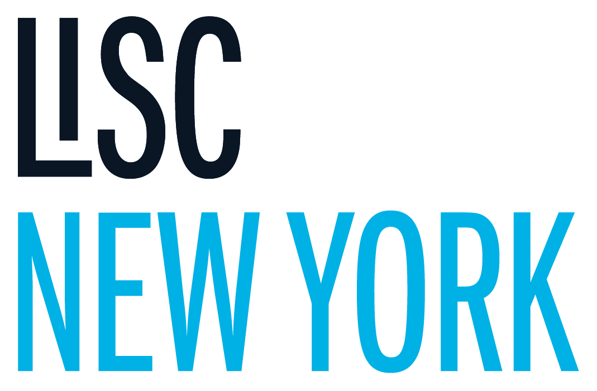

# **AI Integration Strategy for LISC NY**

**Leveraging AI & Salesforce for Sustainable Community Development**

---

## **Table of Contents**

1.  [Comprehensive Vision for AI Integration within LISC NY](#comprehensive-vision-for-ai-integration-within-lisc-ny)
2.  [Integrating the Pre-Qualification Tool with Other Projects & Salesforce ERP](#integrating-the-pre-qualification-tool-with-other-projects--salesforce-erp)
3.  [Nonprofit AI Platform Analysis – Deliverables & Recommendations](#nonprofit-ai-platform-analysis--deliverables--recommendations)
4.  [LISC NY Beta Pre-Qualification System: Strengths, Weaknesses, & Recommendations](#lisc-ny-beta-pre-qualification-system-strengths-weaknesses--recommendations)
5.  [Potential Enhancements for the Pre-Qualification Tool - Executive Presentation Recommendations](#potential-enhancements-for-the-pre-qualification-tool---executive-presentation-recommendations)
6.  [AI for Impact Measurement & Stakeholder Reporting](#ai-for-impact-measurement--stakeholder-reporting)
7.  [Conclusion & Next Steps](#conclusion--next-steps)

---

## **Comprehensive Vision for AI Integration within LISC NY**

LISC NY is uniquely positioned to leverage AI to enhance lending, community development, and policy advocacy while aligning with its overarching mission of fostering equitable and sustainable growth across New York State. AI can provide **real-time insights, optimize funding allocation, enhance impact measurement, and streamline decision-making** by integrating advanced analytics, automation, and predictive modeling into LISC NY’s operations.

**Imagine the possibilities:**

* **For Lending:** AI can transform risk assessment in the Manufactured Housing Loan Program, predicting borrower success with greater accuracy and expanding access to affordable housing.
* **For Community Development:** AI can analyze regional trends, identifying underserved communities and optimizing resource allocation for strategic investments in housing, infrastructure, and emerging industries like semiconductor manufacturing.
* **For Grant Management:** An AI-enhanced pre-qualification system, seamlessly integrated with Salesforce, can revolutionize how we process nonprofit applications, ensuring efficiency and transparency.
* **For Impact Reporting:** AI-driven dashboards within Salesforce can provide real-time, data-backed insights into program performance, empowering us to demonstrate our impact to stakeholders and refine our strategies.

### **Key AI-Driven Enhancements Across LISC NY:**

1.  **Nonprofit Empowerment**: AI-powered insights to help nonprofits operate efficiently, access funding, and measure their impact.
2.  **Data-Driven Lending**: Enhancing underwriting models for the Manufactured Housing Loan Program to improve risk assessment and borrower support.
3.  **Community & Economic Development**: Supporting strategic investments in housing, infrastructure, and emerging industries like semiconductor manufacturing by analyzing trends and optimizing funding allocation.
4.  **Automated Pre-Qualification**: Streamlining nonprofit funding applications via an AI-enhanced pre-qualification system integrated into Salesforce.
5.  **Impact Measurement & Reporting**: AI-driven dashboards and reporting tools within Salesforce to provide real-time visibility into program performance and impact metrics.

[Back to Top](#table-of-contents)

---

## **Integrating the Pre-Qualification Tool with Other Projects & Salesforce ERP**

### **How the Pre-Qualification Tool Works with LISC NY’s Projects:**

The **LISC NY Beta Pre-qualification System** is a **critical AI-driven tool** designed to screen, assess, and pre-qualify nonprofit organizations for funding and program participation. To maximize its effectiveness, it must **seamlessly integrate with Salesforce** and support the broader LISC NY initiative portfolio.

| **Project** | **Pre-Qualification Tool Contribution** |
| -------------------------------------------- | ---------------------------------------------------------------------------------- |
| **Nonprofit Roll Expansion** | Identifies potential nonprofit partners based on need, impact, and eligibility. |
| **Semiconductor Economic Development Expansion** | Helps assess potential community beneficiaries for semiconductor-related investments. |
| **Housing Network Growth** | Identifies high-potential housing projects and funding recipients based on eligibility. |
| **Manufactured Housing Loan Program** | Evaluates potential borrowers and lending risks using AI-driven financial assessments. |

### **Salesforce ERP Integration Plan**

* **Data Consolidation**: The AI platform will integrate with Salesforce to centralize nonprofit applications, funding requests, and impact assessments.
* **Automated Workflows**: AI-driven pre-qualification decisions will trigger automated workflows in Salesforce, streamlining grant approvals and disbursement processes.
* **Real-Time Reporting**: Dashboards within Salesforce will provide up-to-date insights into funding allocations, approval rates, and impact metrics.

[Back to Top](#table-of-contents)

---

## **Nonprofit AI Platform Analysis – Deliverables & Recommendations**

### **1. Project Objectives**

* Empower **nonprofits with data-driven strategies**.
* Optimize **resource allocation and funding distribution** across the 10 regions.
* Improve **long-term impact measurement** and program evaluation.

### **2. Key Features (Current & Future)**

| **Feature** | **Current State** | **Future Enhancements** |
| --------------------------- | ---------------------- | -------------------------------------- |
| **Data Analytics** | Basic trend analysis | Predictive modeling for impact assessment |
| **AI-Powered Insights** | Limited reporting | Automated strategy recommendations |
| **Pre-Qualification Tool** | Standalone screening | Fully integrated with Salesforce |
| **Interactive Dashboards** | Static reports | Real-time AI-driven insights |
| **Automated Funding Allocation** | Manual adjustments | AI-optimized resource distribution |

### **3. Implementation Approach**

* **Phase 1**: Data Integration – Connect Census, Empire State Development, and LISC data to Salesforce.
* **Phase 2**: AI Model Refinement – Improve predictive capabilities for funding decisions.
* **Phase 3**: UX Optimization – Enhance user interfaces for ease of access and decision-making.

### **4. Expected Outcomes**

* **Higher grant efficiency**: AI-driven prioritization of funding allocations.
* **Stronger nonprofit partnerships**: Data-backed insights into community needs.
* **Improved transparency**: Real-time impact measurement through AI analytics.

[Back to Top](#table-of-contents)

---

## **LISC NY Beta Pre-Qualification System: Strengths, Weaknesses, & Recommendations**

### **Strengths**

* **Automated Decision Support**: AI quickly screens applications for eligibility.
* **Data-Driven Insights**: Uses Census and Empire State data for fair evaluations.
* **Time Savings**: Reduces manual review processes significantly.

### **Weaknesses**

* **Limited Customization**: Cannot fully adapt to complex funding requirements.
* **Lack of User-Friendly UI**: Navigation and form submission are not intuitive.
* **No Direct Integration with Salesforce**: Data must be manually transferred.

[Back to Top](#table-of-contents)

---

## **Potential Enhancements for the Pre-Qualification Tool - Executive Presentation Recommendations**

Here are key areas where the consultant can significantly improve the Pre-Qualification Tool, enhancing its effectiveness and alignment with LISC's strategic goals.

### AI Model/Algorithm Improvements

* **Enhance Predictive Capabilities for High-Impact Projects:** Refine the AI's predictive modeling to more accurately identify projects likely to yield significant community impact.
* **Implement Natural Language Processing (NLP) for Proposal Review:** Integrate NLP to efficiently analyze and summarize nonprofit proposals, saving time and improving review consistency.
* **Establish Machine Learning Feedback Loops for Criteria Refinement:** Create a system where the AI continuously learns from application outcomes, automatically adjusting eligibility criteria to improve accuracy over time.
* **Integrate Bias Detection Algorithms:** Ensure fairness and equity by incorporating algorithms that identify and mitigate potential biases in the evaluation process.
* **Enable Real-Time Fraud Detection:** Implement advanced fraud detection to identify and prevent fraudulent grant applications, safeguarding LISC's resources.

### UI/UX Enhancements

* **Develop a Mobile-Friendly Application Interface:** Ensure the tool is accessible and user-friendly on mobile devices, accommodating the needs of diverse nonprofit users.
* **Enable Seamless Salesforce Integration:** Implement one-click integration with Salesforce to streamline data flow and eliminate manual data entry.
* **Provide Real-Time Application Status Tracking:** Allow applicants to monitor their application status and progress through the pre-qualification process.

### Integration & Efficiency Enhancements

* **Automate Data Synchronization with Salesforce ERP:** Implement automatic data synchronization to maintain consistency and reduce manual effort.
* **Introduce Role-Based Access Control:** Implement controls to ensure that LISC staff have appropriate access levels based on their roles and responsibilities.
* **Integrate Live Chat Support:** Offer real-time technical assistance to applicants, improving user experience and reducing support inquiries.
* **Implement AI-Powered Document Verification:** Automate the verification of submitted documents to reduce fraudulent activity and improve application accuracy. This will also address the high levels of potential fraudulent activity observed.

### Reporting & Analysis Enhancements

* **Develop Customized AI-Generated Funding Reports:** Create tailored reports for decision-makers, providing key insights and recommendations.
* **Include Benchmarking Analytics:** Allow for comparison of applications across different regions, providing valuable context for funding decisions.
* **Enable Trend Forecasting for Community Funding Needs:** Utilize AI to identify emerging trends
