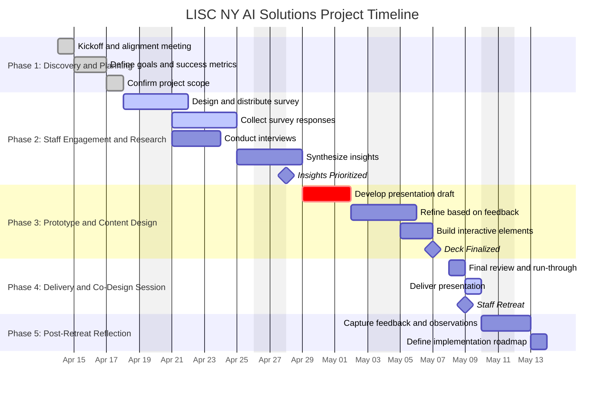

# LISC NY AI Solutions Project: High-Level Plan

## Project Overview

The LISC NY AI Solutions Project is a time-bound initiative aimed at improving operational efficiency, optimizing staff capacity, and enhancing organizational performance through targeted AI applications. By automating routine processes and improving access to actionable data, this project supports LISC NY’s broader strategic objectives: service scalability, cost-effectiveness, and results-based management.

This initiative is grounded in operational alignment and stakeholder engagement. It is structured to ensure that solutions address measurable pain points, are informed by end-user experience, and are scalable across departments. The anticipated outcomes include reduced manual workloads, improved pipeline oversight, and enhanced decision-making quality across programs and operations.

Key areas of focus include:
- Workflow automation to reduce administrative burden  
- Enhanced data access to support planning and reporting  
- Tools that support agile, data-informed resource allocation  

---

## Key Deliverables

- Staff insight report based on survey results and qualitative engagement  
- Executive-level AI Solutions presentation aligned with organizational goals  
- Co-design workshop session with synthesized feedback and solution themes  
- Initial post-retreat roadmap for implementation, with a focus on operational gains  
- Recommendations for prioritized use cases, including estimated efficiency impact  

---

## Project Phases and Timeline

| Phase                               | Timeline                | Objectives                                                  |
|------------------------------------|-------------------------|-------------------------------------------------------------|
| 1. Discovery and Strategic Planning | Week 1 (April 14–17)     | Confirm goals, success metrics, and define strategic scope  |
| 2. Staff Engagement and Research    | Weeks 2–3 (April 18–25)  | Gather frontline insights and identify high-friction processes |
| 3. Prototype and Content Design     | Weeks 3–4 (April 25–May 1)| Develop interactive presentation and align messaging with priorities |
| 4. Delivery and Co-Design Session   | Week 4 (May 2–6)         | Present solutions, gather feedback, and validate priorities |

---

## Key Milestones

- **April 18, 2025** – Staff survey launched  
- **April 24, 2025** – Survey themes synthesized and insights prioritized  
- **April 29, 2025** – First draft of presentation completed  
- **May 1, 2025** – Final presentation reviewed and approved  
- **May 6, 2025** – Presentation delivered at LISC NY Staff Retreat  

---

## Project Timeline (Gantt Chart)

---

## Next Steps

- Finalize synthesis of feedback from staff engagement activities  
- Complete production of executive-ready presentation materials  
- Facilitate co-design session during the May 6 Staff Retreat  
- Document key takeaways and align on priorities for implementation  
- Develop a post-retreat roadmap with operational KPIs and success metrics  

Primary stakeholders include LISC NY leadership, departmental staff, IT and data teams, and external technology partners.

---

*Last updated: April 17, 2025*
